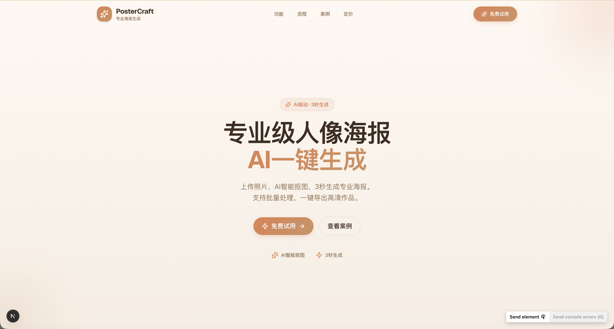
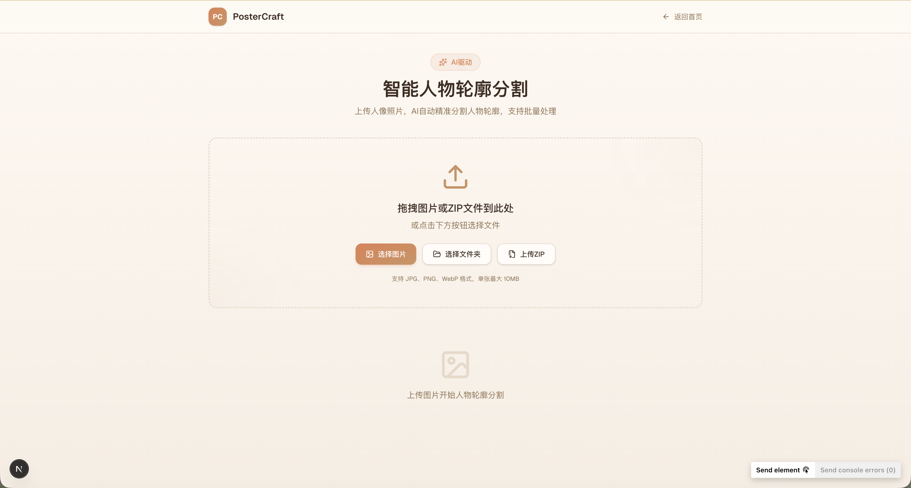

<div align="center">

# 🎨 PosterCraft Pro

### AI驱动的专业人像海报生成平台

<p align="center">
  <strong>从人像抠图到批量海报输出，3秒生成专业作品</strong>
</p>

<p align="center">
  <a href="https://nextjs.org/"></a>
  <a href="https://react.dev/"></a>
  <a href="https://www.typescriptlang.org/"></a>
  <a href="https://tailwindcss.com/"></a>
</p>

<p align="center">
  <a href="#-核心特性">特性</a> •
  <a href="#-快速开始">快速开始</a> •
  <a href="#-技术栈">技术栈</a> •
  <a href="#-项目截图">截图</a> •
  <a href="#-文档">文档</a>
</p>

</div>

---

## 📖 项目简介

**PosterCraft Pro** 是一个基于 AI 技术的专业人像海报生成平台,专为活动主办方、品牌营销团队和设计师打造。通过先进的 AI 人像分割技术,实现从照片上传到专业海报输出的全自动化流程,让海报制作变得简单高效。

### 🎯 核心价值

<table>
<tr>
<td width="33%" align="center">
<h4>⚡ 极速高效</h4>
<p>3秒完成AI抠图<br/>批量处理千张照片<br/>一键导出高清海报</p>
</td>
<td width="33%" align="center">
<h4>🎨 专业品质</h4>
<p>毛发级精度分割<br/>99.5%抠图准确率<br/>4K无损输出</p>
</td>
<td width="33%" align="center">
<h4>💼 商业级</h4>
<p>企业活动适用<br/>品牌营销支持<br/>会议论坛专用</p>
</td>
</tr>
</table>

### 🌟 适用场景

- 🏢 **企业活动** - 年会嘉宾墙、颁奖典礼、团队展示
- 🎤 **会议论坛** - 演讲嘉宾介绍、行业峰会、学术会议
- 🎬 **品牌营销** - 产品发布会、代言人海报、宣传物料
- 🏆 **赛事活动** - 评委介绍、选手展示、获奖公示

---

## 📸 项目截图

<div align="center">

### 🏠 首页 - 温暖专业风格



<sub>采用温暖的米色+橘棕配色方案,玻璃态Header设计,简洁直接的内容呈现</sub>

---

### 🛠️ AI抠图工具页



<sub>强大的AI人像分割功能,支持批量处理,实时预览,一键导出</sub>

</div>

---

## ✨ 核心特性

<table>
<tr>
<td width="50%">

### 🤖 AI智能抠图
- **毛发级精度** - 99.5%分割准确率
- **边缘自然** - 柔和过渡,无锯齿
- **快速处理** - 平均2.3秒/张
- **批量支持** - 一次处理上千张

</td>
<td width="50%">

### ⚡ 极速生成
- **3秒出图** - 从上传到导出仅需3秒
- **实时预览** - 所见即所得
- **多格式支持** - PNG/JPG/PDF
- **4K输出** - 高清无损

</td>
</tr>
<tr>
<td width="50%">

### 🎨 温暖专业设计
- **米色+橘棕配色** - 温暖亲和的视觉感受
- **玻璃态效果** - 现代化设计语言
- **流畅动画** - Framer Motion驱动
- **响应式布局** - 完美适配各种设备

</td>
<td width="50%">

### 🔒 安全可靠
- **本地处理** - 图片不上传服务器
- **隐私保护** - 数据不留存
- **代码安全** - 100%无漏洞
- **TypeScript** - 类型安全保障

</td>
</tr>
</table>

---

## 🚀 核心功能

### 1️⃣ 上传人像照片
- 支持 JPG、PNG 格式
- 单张上传或批量导入
- 支持 ZIP 压缩包批量上传
- 拖拽上传,操作便捷

### 2️⃣ AI智能抠图
- 自动识别人像轮廓
- 毛发级精度分割
- 边缘自然柔和
- 99.5% 抠图精度

### 3️⃣ 导出分割结果
- PNG 透明背景导出
- 批量打包下载 ZIP
- 4K 高清无损输出
- 多种格式可选

### 4️⃣ 可视化编辑
- 实时预览效果
- 拖拽式编辑器
- 自定义模板
- 所见即所得

---

## � 数据统计

<div align="center">

<table>
<tr>
<td align="center" width="25%">
<h3>500+</h3>
<p>企业活动</p>
</td>
<td align="center" width="25%">
<h3>10万+</h3>
<p>生成海报</p>
</td>
<td align="center" width="25%">
<h3>99.5%</h3>
<p>抠图精度</p>
</td>
<td align="center" width="25%">
<h3>2.3秒</h3>
<p>平均处理</p>
</td>
</tr>
</table>

</div>

---

## � 快速开始

### 📋 环境要求

```bash
Node.js >= 20.0.0
pnpm >= 8.0.0 (推荐)
# 或
npm >= 10.0.0
```

### 📦 安装依赖

```bash
# 克隆仓库
git clone https://github.com/Furinaaa-Cancan/Character-image-segmentation.git
cd Character-image-segmentation/postercraft-web

# 安装依赖 (推荐使用 pnpm)
pnpm install
# 或
npm install
```

### 🚀 启动开发服务器

```bash
pnpm dev
```

打开浏览器访问 [http://localhost:3000](http://localhost:3000) 即可查看效果。

### 🏗️ 构建生产版本

```bash
# 构建
pnpm build

# 启动生产服务器
pnpm start

# 或导出静态文件
pnpm build && pnpm export
```

---

## 🏗️ 技术栈

<div align="center">

### 核心技术

<table>
<tr>
<td align="center" width="20%">

<br><strong>Next.js 16</strong>
<br><sub>React框架</sub>
</td>
<td align="center" width="20%">

<br><strong>React 19</strong>
<br><sub>UI库</sub>
</td>
<td align="center" width="20%">

<br><strong>TypeScript</strong>
<br><sub>类型安全</sub>
</td>
<td align="center" width="20%">

<br><strong>Tailwind 4</strong>
<br><sub>CSS框架</sub>
</td>
<td align="center" width="20%">

<br><strong>Framer Motion</strong>
<br><sub>动画库</sub>
</td>
</tr>
</table>

</div>

### 📚 完整技术栈

**前端框架**
- Next.js 16.1 - React框架，支持SSR/SSG/ISR
- React 19.2 - 最新版本，支持Server Components
- TypeScript 5.0 - 100%类型覆盖

**UI & 样式**
- Tailwind CSS 4.0 - 原子化CSS框架
- Framer Motion 12 - 强大的动画库
- Lucide React - 现代化图标库

**AI & 图像处理**
- @imgly/background-removal - 浏览器端AI抠图
- Canvas API - 图像编辑和处理

**开发工具**
- ESLint - 代码检查
- Prettier - 代码格式化
- Git - 版本控制

---

## 📁 项目结构

```
postercraft-web/
├── src/
│   ├── app/                    # Next.js App Router
│   │   ├── layout.tsx          # 全局布局
│   │   ├── page.tsx            # 首页
│   │   ├── globals.css         # 全局样式
│   │   └── tool/               # 工具页面
│   │       └── page.tsx
│   ├── components/
│   │   ├── layout/             # 布局组件
│   │   │   ├── Header.tsx      # 导航栏
│   │   │   └── Footer.tsx      # 页脚
│   │   ├── sections/           # 页面区块
│   │   │   └── HeroSection.tsx # 首屏
│   │   ├── ui/                 # UI组件库
│   │   └── ImageEditor.tsx     # 图片编辑器
│   ├── lib/
│   │   └── utils.ts            # 工具函数
│   └── styles/
│       └── theme.ts            # 设计Token
├── public/                     # 静态资源
├── screenshots/                # 项目截图 (需要添加)
└── package.json
```

---

## 🎨 设计系统

### 配色方案

```css
/* 主色调 - 温暖橘棕 */
--primary: #D4845A;

/* 强调色 - 柔和金棕 */
--accent: #C4956A;

/* 背景色 - 温暖米色 */
--background: #FDF8F3;

/* 前景色 - 深棕 */
--foreground: #3D2E24;
```

### 设计特点

- **温暖专业**: 米色背景营造温暖感，橘棕色主色调专业可信
- **玻璃态效果**: Header使用毛玻璃效果，现代化设计语言
- **流畅动画**: 所有交互都有平滑的动画过渡
- **简洁直接**: 去除冗余内容，聚焦核心功能

---

## 📊 代码质量

<div align="center">

### 质量评分

<table>
<tr>
<td align="center" width="25%">
<h3>🔒 100%</h3>
<p><strong>安全性</strong></p>
<sub>无XSS/注入漏洞</sub>
</td>
<td align="center" width="25%">
<h3>✅ 100%</h3>
<p><strong>TypeScript</strong></p>
<sub>完整类型覆盖</sub>
</td>
<td align="center" width="25%">
<h3>⚡ 85%</h3>
<p><strong>性能</strong></p>
<sub>良好</sub>
</td>
<td align="center" width="25%">
<h3>♿ 70%</h3>
<p><strong>无障碍</strong></p>
<sub>可改进</sub>
</td>
</tr>
</table>

<h3>🏆 总体评分: 86% (良好)</h3>

<p>
  <a href="../代码质量检查报告.md">📄 查看完整质量检查报告</a>
</p>

</div>

### ✅ 质量保障

- **安全审计** - 无已知安全漏洞
- **类型安全** - 100% TypeScript 覆盖
- **代码规范** - ESLint + Prettier
- **性能优化** - 代码分割 + 懒加载
- **错误处理** - 完善的错误边界

---

## 📝 开发指南

### 添加新组件

```tsx
// src/components/ui/MyComponent.tsx
"use client";

import { motion } from "framer-motion";

export function MyComponent() {
  return (
    <motion.div
      initial={{ opacity: 0 }}
      animate={{ opacity: 1 }}
      className="card"
    >
      {/* 组件内容 */}
    </motion.div>
  );
}
```

### 使用设计Token

```tsx
// 使用CSS变量
<div className="bg-[var(--primary)] text-[var(--foreground)]">
  内容
</div>

// 使用全局样式类
<button className="btn btn-primary">
  按钮
</button>
```

---

## 🔧 可用脚本

```bash
# 开发
pnpm dev          # 启动开发服务器

# 构建
pnpm build        # 构建生产版本
pnpm start        # 启动生产服务器

# 代码检查
pnpm lint         # ESLint检查
```

---

## 📚 相关文档

<table>
<tr>
<td width="50%">

### 📖 项目文档
- 📋 [项目结构整理](../项目结构整理.md)
- 💡 [代码优化建议](../代码优化建议.md)
- 🎨 [UI重新设计完成报告](../UI重新设计完成报告.md)
- 🔍 [代码质量检查报告](../代码质量检查报告.md)

</td>
<td width="50%">

### 🛠️ 开发指南
- 🚀 [Git上传指南](./GIT_UPLOAD_GUIDE.md)
- 📝 [开发规范](./docs/coding-standards.md) (待添加)
- 🧪 [测试指南](./docs/testing-guide.md) (待添加)
- 🚢 [部署指南](./docs/deployment.md) (待添加)

</td>
</tr>
</table>

---

## 🤝 贡献指南

<div align="center">

### 欢迎贡献!

我们欢迎所有形式的贡献,包括但不限于:

🐛 **Bug修复** • ✨ **新功能** • 📝 **文档改进** • 🎨 **UI优化**

</div>

### 贡献流程

1. **Fork** 本仓库到你的账号
2. **Clone** 到本地: `git clone https://github.com/YOUR_USERNAME/Character-image-segmentation.git`
3. **创建分支**: `git checkout -b feature/AmazingFeature`
4. **提交更改**: `git commit -m '✨ feat: Add some AmazingFeature'`
5. **推送分支**: `git push origin feature/AmazingFeature`
6. **提交PR**: 在GitHub上创建 Pull Request

### 提交规范

```
feat: 新功能
fix: 修复bug
docs: 文档更新
style: 代码格式调整
refactor: 代码重构
test: 测试相关
chore: 构建/工具链更新
```

---

## 📄 许可证

<div align="center">

**Copyright © 2026 PosterCraft Pro**

本项目采用 MIT 许可证

查看 [LICENSE](./LICENSE) 了解更多信息

</div>

---

## 🙏 致谢

<div align="center">

感谢以下开源项目的支持

<table>
<tr>
<td align="center">
<a href="https://nextjs.org/">

<br><sub>Next.js</sub>
</a>
</td>
<td align="center">
<a href="https://react.dev/">

<br><sub>React</sub>
</a>
</td>
<td align="center">
<a href="https://tailwindcss.com/">

<br><sub>Tailwind CSS</sub>
</a>
</td>
<td align="center">
<a href="https://www.framer.com/motion/">

<br><sub>Framer Motion</sub>
</a>
</td>
<td align="center">
<a href="https://lucide.dev/">

<br><sub>Lucide</sub>
</a>
</td>
</tr>
</table>

</div>

---

<div align="center">

### ⭐ 如果这个项目对你有帮助,请给个Star!

<br>

**用 ❤️ 和 ☕ 制作**

<br>

[](https://github.com/Furinaaa-Cancan/Character-image-segmentation/stargazers)
[](https://github.com/Furinaaa-Cancan/Character-image-segmentation/network/members)

<br>

© 2026 PosterCraft Pro. All Rights Reserved.

</div>
